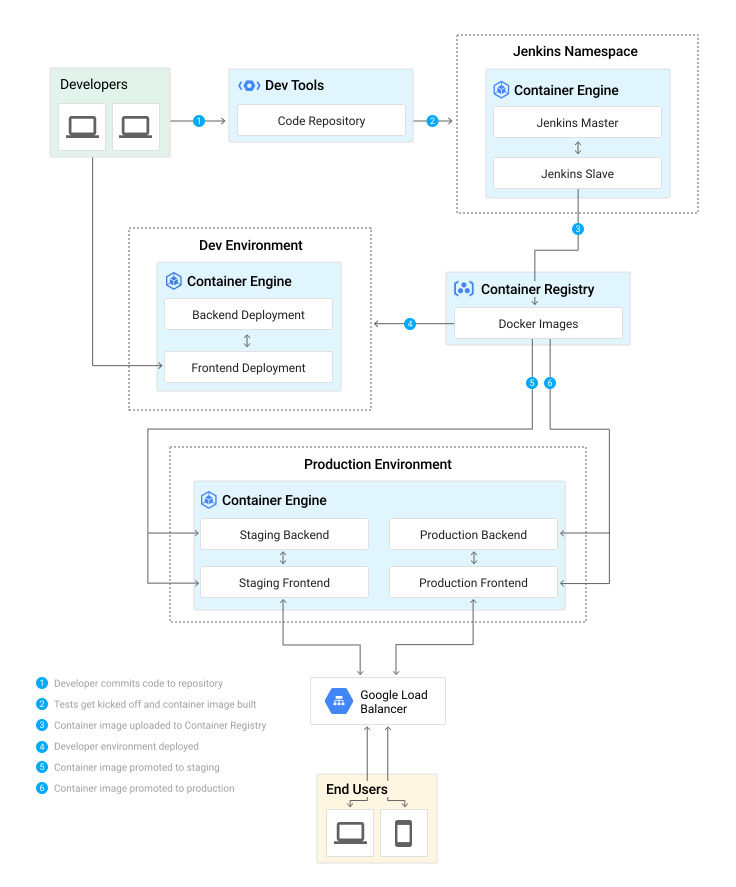

# Lab: Build a Continuous Deployment Pipeline with Jenkins and Kubernetes

## Introduction
This guide will take you through the steps necessary to continuously deliver your software to end users by leveraging [Google Container Engine](https://cloud.google.com/container-engine/) and [Jenkins](https://jenkins.io) to orchestrate the software delivery pipeline.
If you are not familiar with basic Kubernetes concepts, have a look at [Kubernetes 101](http://kubernetes.io/docs/user-guide/walkthrough/).

## The sample pipeline


## The sample app
You'll use a very simple sample application - `gceme` - as the basis for your CD pipeline. `gceme` is written in Go and is located in the `sample-app` directory in this repo. When you run the `gceme` binary on a GCE instance, it displays the instance's metadata in a pretty card:


The binary supports two modes of operation, designed to mimic a microservice. In backend mode, `gceme` will listen on a port (8080 by default) and return GCE instance metadata as JSON, with content-type=application/json. In frontend mode, `gceme` will query a backend `gceme` service and render that JSON in the UI you saw above. It looks roughly like this:

```
-----------      ------------      ~~~~~~~~~~~~        -----------
|         |      |          |      |          |        |         |
|  user   | ---> |   gceme  | ---> | lb/proxy | -----> |  gceme  |
|(browser)|      |(frontend)|      |(optional)|   |    |(backend)|
|         |      |          |      |          |   |    |         |
-----------      ------------      ~~~~~~~~~~~~   |    -----------
                                                  |    -----------
                                                  |    |         |
                                                  |--> |  gceme  |
                                                       |(backend)|
                                                       |         |
                                                       -----------
```
Both the frontend and backend modes of the application support two additional URLs:

1. `/version` prints the version of the binary (declared as a const in `main.go`)
1. `/healthz` reports the health of the application. In frontend mode, health will be OK if the backend is reachable.


## Labs
* [Workshop Setup](labs/workshop-setup.md)
* [Kubernetes Overview](labs/k8s-quick-tour.md)
* [Create Kubernetes Objects](labs/create-k8s-objects.md)
* [Connect to Jenkins](labs/connect-to-jenkins.md)
* [Deploy Sample App to K8s](labs/deploy-sample-app.md)
* [Create a Pipeline](labs/create-jenkins-pipeline.md)
* [Deploy to Development Branch](labs/deploy-jenkins-development-branch.md)
* [Wrap Up](labs/clean-up.md)


## Links

For a more in-depth best practices guide, go to the solution posted [here](https://cloud.google.com/solutions/jenkins-on-container-engine).
